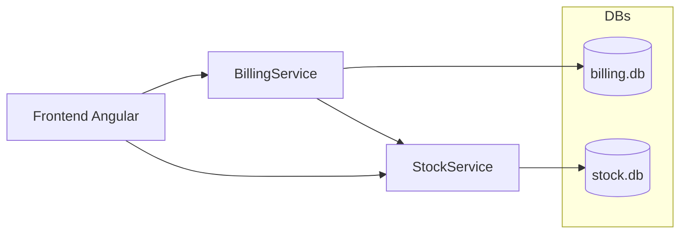

# Sistema de Emissão de Notas Fiscais


Aplicação **full stack** para emissão e gestão de notas fiscais, baseada em arquitetura de microsserviços com backend em ASP.NET Core e frontend em Angular.

## Tecnologias

- Frontend: Angular 20, TypeScript
- Backend:
  - `StockService`: ASP.NET Core 10 + EF Core + SQLite
  - `BillingService`: ASP.NET Core 10 + EF Core + SQLite
- Banco de dados: SQLite (um por microsserviço)
- Scripts: PowerShell (`build-all.ps1`)

## Arquitetura

A solução é composta por três principais componentes:

- Microsserviço de **Estoque** (`StockService`):
  - Cadastro de produtos
  - Consulta de saldos
  - Baixa de estoque
  - Simulação de falha no serviço de estoque
- Microsserviço de **Faturamento** (`BillingService`):
  - Criação de notas fiscais
  - Numeração sequencial automática
  - Status da nota: `Aberta` ou `Fechada`
  - Impressão de notas fiscais
- **Frontend Angular** (`frontend`):
  - Interface única para:
    - Cadastrar produtos
    - Abrir e gerenciar notas fiscais
    - Imprimir notas
    - Testar o comportamento de falha do serviço de estoque

Cada microsserviço possui seu próprio banco SQLite:

- `StockService/stock.db`
- `BillingService/billing.db`

## Diagrama (visão geral)



## Estrutura do Repositório

- `BillingService/` – Microsserviço de faturamento (API .NET)
- `StockService/` – Microsserviço de estoque (API .NET)
- `frontend/` – Aplicação Angular
- `SistemaNotaFiscal.sln` – Solution do Visual Studio
- `SistemaNotaFiscal.slnx` – Arquivo de workspace
- `build-all.ps1` – Script para build dos serviços backend
- `DETALHAMENTO_TECNICO.md` – Documento com detalhamento técnico da solução

## Pré-requisitos

- .NET SDK 10 instalado
- Node.js 20+ instalado
- Angular CLI instalada globalmente:
  ```bash
  npm install -g @angular/cli
  ```
- PowerShell (para usar `build-all.ps1`, opcional)

## Como rodar o projeto

### 1. Clonar o repositório

```bash
git clone https://github.com/Lucassilva027/Nota_Fiscal_Projeto.git
cd Nota_Fiscal_Projeto
```

### 2. Subir os microsserviços (.NET)

#### Opção A: usando o script (recomendado no Windows)

```powershell
./build-all.ps1
```

#### Opção B: manualmente

Em um terminal:

```bash
cd StockService
dotnet restore
dotnet run
```

Em outro terminal:

```bash
cd BillingService
dotnet restore
dotnet run
```

(Se necessário, ajuste as portas no `appsettings.json` ou `launchSettings.json` de cada serviço.)

### 3. Subir o frontend (Angular)

Em outro terminal:

```bash
cd frontend
npm install
ng serve
```

Por padrão, o Angular sobe em:

- Frontend: http://localhost:4200

Certifique-se de que as URLs dos serviços (`StockService` e `BillingService`) configuradas no frontend apontam para as portas corretas usadas pelo backend.

## Funcionalidades implementadas

- Cadastro de produtos com:
  - Código
  - Descrição
  - Saldo em estoque
- Cadastro de notas fiscais com múltiplos produtos e quantidades
- Numeração sequencial automática para notas fiscais
- Impressão de nota apenas quando o status está `Aberta`
- Atualização do status para `Fechada` após impressão bem-sucedida
- Baixa de estoque com base nas quantidades da nota
- Simulação de falha no serviço de estoque com feedback visual ao usuário
- Recuperação do fluxo após desativar a falha simulada
- Idempotência na baixa de estoque por chave de operação da nota

## Como usar (fluxo básico)

1. Cadastrar produtos no microsserviço de estoque via frontend.
2. Criar uma nova nota fiscal, adicionando produtos e quantidades.
3. Salvar a nota em status `Aberta`.
4. Realizar a impressão da nota:
   - Em caso de sucesso:
     - Status muda para `Fechada`
     - Estoque é baixado conforme as quantidades da nota
   - Em caso de falha no serviço de estoque:
     - Usuário recebe feedback visual
     - Estoque não é baixado
5. Desativar a simulação de falha e repetir a operação para validar a idempotência do processo.

## Desenvolvimento

### Abrir no Visual Studio

1. Abrir o arquivo `SistemaNotaFiscal.sln`.
2. Definir projetos de startup (por exemplo, `StockService` e `BillingService`).
3. Iniciar a depuração.

### Executar via CLI

Você também pode executar cada serviço somente com CLI, usando:

```bash
dotnet run
```

na pasta de cada projeto.

## Documentação adicional

Mais detalhes de design, decisões técnicas e estrutura interna podem ser encontrados em:

- [`DETALHAMENTO_TECNICO.md`](./DETALHAMENTO_TECNICO.md)

## Próximos passos / Ideias de melhoria

- Adicionar autenticação e autorização básica (ex.: JWT)
- Criar testes automatizados (unitários e de integração)
- Dockerizar os serviços e o frontend
- Adicionar CI/CD (GitHub Actions) para build e testes
- Melhorar tratamento de erros e observabilidade (logs estruturados, métricas)
